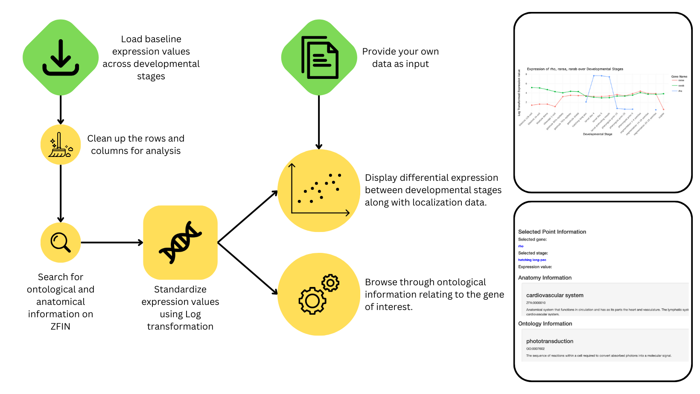

# AtlaZ

## Description

AtlaZ is a toolkit designed for the analysis and visualization of
zebrafish gene expression data across developmental stages and tissues.
This package facilitates the integration of anatomical data, gene
expression profiles, and ontological information, enabling researchers
to explore the assortment of gene expression across developmental stages
in zebrafish.

The package uses the E-ERAD-475 dataset available from the [Expression
Atlas](https://www.ebi.ac.uk/gxa/experiments/E-ERAD-475/Downloads) which
contains the expression values of all genes found in zebrafish across
all developmental stages.

It was built as an R package, and was developed as a part of a course
project for [BCB410H1: Applied
Bioinformatics](https://artsci.calendar.utoronto.ca/course/bcb410h1)
during the Fall 2023 semester at the University of Toronto. The
development environment used was:

| Software | Version                        |
|----------|--------------------------------|
| R        | 4.3.1                          |
| Platform | arch64-apple-darwin20 (64-bit) |
| OS       | macOS Sonoma 14.1.2            |

## Installation

To install the latest development version of AtlaZ, run the following
code in R:

``` r
install.packages("devtools")
library("devtools")
devtools::install_github("ashenafee/AtlaZ", build_vignettes = TRUE)
library("AtlaZ")
```

To run the Shiny app:

``` r
runAtlaZ()
```

## Overview

To get an overview of AtlaZ in your R session, run the following code:

``` r
ls("package:AtlaZ")
data(package = "AtlaZ")
browseVignettes("AtlaZ")
```

AtlaZ has one major class, `Gene`, which is used to store information
about a gene. It has the following attributes:

| Attribute    | Description                                                                                                  |
|--------------|--------------------------------------------------------------------------------------------------------------|
| `geneSymbol` | The gene symbol of the gene.                                                                                 |
| `ensemblID`  | The Ensembl ID of the gene.                                                                                  |
| `zfinID`     | The ZFIN ID of the gene.                                                                                     |
| `anatomy`    | An `AnatomyList` object containing information on the different possible areas where this gene is expressed. |
| `ontology`   | An `OntologyList` object containing information on the different possible GO groups this gene falls into.    |

The `AnatomyList` class stores many `Anatomy` objects which contain
information on a specific area where a gene is expressed. In a similar
fashion, the `OntologyList` class stores many `Ontology` objects which
contain information on a specific GO group a gene falls into. These
classes are a new addition as prior there was lots of wrangling with
nested lists to get this information. By using these classes, it is much
easier to access the information from one single `Gene` object.

**Data Visualization**

`plotGeneExpression` is a function that creates a line plot of gene
expression values for a specific gene over different developmental
stages. The line plot is an effective way to visualize how the
expression of a particular gene changes across different stages of
development. Each point on the line corresponds to a gene expression
value at a particular developmental stage, and the line’s progression
shows the trend of these values over time. This can help researchers
identify patterns or anomalies in gene expression, which can be critical
in understanding gene function and its role in development.

`plotMultipleGeneExpression` does the same thing as
`plotGeneExpression`, but for multiple genes. This is useful for
comparing the expression of multiple genes across different
developmental stages.

**Fetching from ZFIN**

`getZfinBackgroundInfo(zfinId: str)` is a function that fetches
background information about a gene from ZFIN. This function was
initially used to obtain the anatomical and ontological information, but
`getGeneInfo()` is now favoured.

**Fetching from Ensembl**

`getGeneInfo(geneSymbols: str[])` is a function that fetches information
on one or more genes from Ensembl. This function is used to populate the
`Gene` object with information about the gene. This function is also
used to populate the `AnatomyList` and `OntologyList` objects with
information about the different areas where the gene is expressed and
the different GO groups the gene falls into, respectively.

 **Figure 1.** An overview
of the AtlaZ workflow and how it works on a high level.

AtlaZ mainly uses the data from the [E-ERAD-475
dataset](https://www.ebi.ac.uk/gxa/experiments/E-ERAD-475/Downloads),
and that’s where most functionality is unlocked/tested.

If data is provided as input (i.e., it’s from the user and **not** from
ZFIN), it must be cleaned up and formatted first before it can be used
by AtlaZ. This data must be formatted with the following headings: Gene
ID, Gene Name, zygote, cleavage 2-cell, blastula 128-cell, blastula
1k-cell, blastula dome, gastrula 50%-epiboly, gastrula shield, gastrula
75%-epiboly, segmentation 1-4 somites, segmentation 14-19 somites,
segmentation 20-25 somites, pharyngula prim-5, pharyngula prim-15,
pharyngula prim-25, hatching long-pec, larval protruding mouth larval
day 4, larval day 5.

A valid Ensembl identifier must be under `Gene ID` with a valid gene
symbol under `Gene Name`. The rest of the columns can consist of
numerical values as those represent expression values across each
development stage.

## Contributions

My name is Ashenafee Mandefro, and I am the author of this package. I’ve
worked with large databases similar to ZFIN in the past (i.e., GenBank,
Ensembl) and I want to adapt my skills to a zebrafish context, given
that fits into the context of my current thesis project at the [Lin
Lab](https://lin.csb.utoronto.ca/). You can see more of my projects
[here](https://github.com/ashenafee).

[Expression Atlas](https://www.ebi.ac.uk/gxa/home) is used as the
primary data source in AtlaZ, with the primary dataset being [E-ERAD-475
dataset](https://www.ebi.ac.uk/gxa/experiments/E-ERAD-475/Downloads).
Aside from Expression Atlas, more datasets are available for download
from ZFIN from their website which is available
[here](https://zfin.org/downloads). The data provided by ZFIN is
licensed under the [Creative Commons Attribution 4.0 International
License](https://creativecommons.org/licenses/by/4.0/).

Generative AI was used to help with creating the initial documentation
for each function. Specifically, GitHub Copilot was prompted with the
contents of the function and an initial docstring, and it generated a
final docstring that was then edited by the author. More information on
GitHub Copilot is available [here](https://copilot.github.com/).

## References

Bradford, Y. M., Van Slyke, C. E., Ruzicka, L., Singer, A., Eagle, A.,
Fashena, D., Howe, D. G., Frazer, K., Martin, R., Paddock, H., Pich, C.,
Ramachandran, S., & Westerfield, M. (2022). Zebrafish information
network, the knowledgebase for Danio rerio research. In V. Wood (Ed.),
*Genetics* (Vol. 220, Issue 4). Oxford University Press (OUP).
<https://doi.org/10.1093/genetics/iyac016>

Durinck, S., Moreau, Y., Kasprzyk, A., Davis, S., De Moor, B., Brazma,
A., & Huber, W. (2005). BioMart and Bioconductor: a powerful link
between biological databases and microarray data analysis.
*Bioinformatics*, Vol. 21, pp. 3439–3440.

Durinck, S., Spellman, P. T., Birney, E., & Huber, W. (2009). Mapping
identifiers for the integration of genomic datasets with the
R/Bioconductor package biomaRt. *Nature Protocols*, Vol. 4,
pp. 1184–1191.

Sievert, C. (2021). Interactive Web-Based Data Visualization with R,
Plotly, and Shiny. Chapman and Hall/CRC. <https://plotly-r.com>

Wickham, H. (2016). ggplot2: Elegant Graphics for Data Analysis.
Retrieved from <https://ggplot2.tidyverse.org>

Wickham, H., François, R., Henry, L., Müller, K., & Vaughan, D. (2023).
dplyr: A Grammar of Data Manipulation. Retrieved from
<https://CRAN.R-project.org/package=dplyr>

Wickham, H. (2023). httr: Tools for Working with URLs and HTTP.
Retrieved from <https://CRAN.R-project.org/package=httr>

Wickham, H., Hester, J., & Bryan, J. (2023). readr: Read Rectangular
Text Data. Retrieved from <https://CRAN.R-project.org/package=readr>

Wickham, H., Vaughan, D., & Girlich, M. (2023). tidyr: Tidy Messy Data.
Retrieved from <https://CRAN.R-project.org/package=tidyr>

WikiPathways: a multifaceted pathway database bridging metabolomics to
other omics research. (2018, January). *Nucleic Acids Res*., Vol. 46,
pp. D661–D667.

White, R. J., Collins, J. E., Sealy, I. M., Wali, N., Dooley, C. M.,
Digby, Z., Stemple, D. L., Murphy, D. N., Billis, K., Hourlier, T.,
Füllgrabe, A., Davis, M. P., Enright, A. J., & Busch-Nentwich, E. M.
(2017). A high-resolution mRNA expression time course of embryonic
development in zebrafish. In eLife (Vol. 6). *eLife Sciences
Publications*, Ltd. <https://doi.org/10.7554/elife.30860>

## Acknowledgements

This package was developed as part of an assessment for 2023 BCB410H:
Applied Bioinformat- ics course at the University of Toronto, Toronto,
CANADA. AtlaZ welcomes issues, enhancement requests, and other
contributions. To submit an issue, use the GitHub issues.
