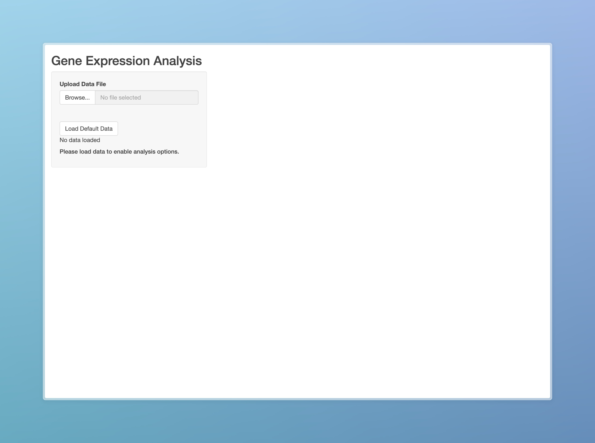
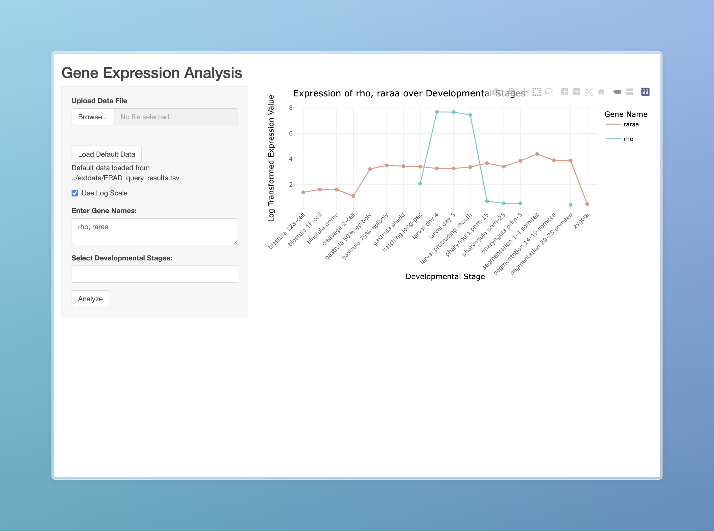
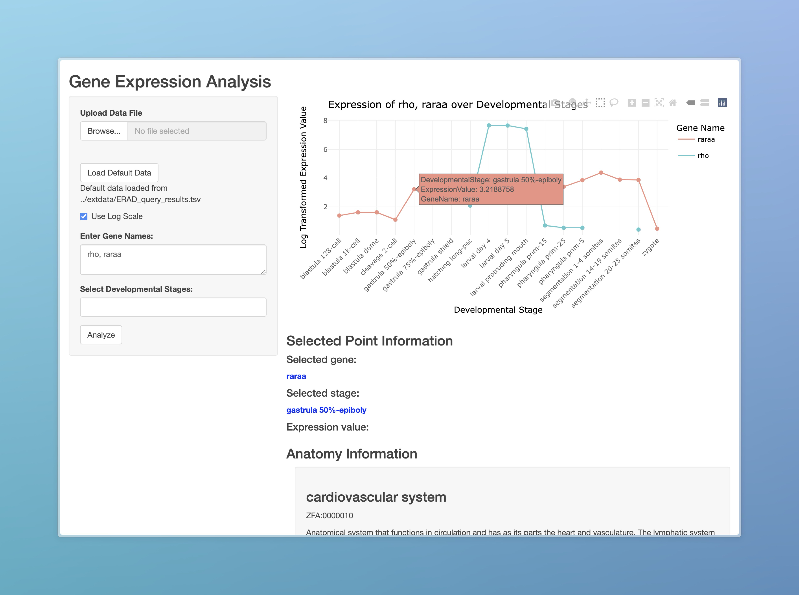

```{r setup, include=FALSE}
library(knitr)
opts_chunk$set(
    fig.align = "center",
    out.width = "90%",
    fig.width = 6, fig.height = 5.5,
    dev.args = list(pointsize = 10),
    par = TRUE, # needed for setting hook
    collapse = TRUE, # collapse input & ouput code in chunks
    warning = FALSE
)
knit_hooks$set(par = function(before, options, envir) {
    if (before && options$fig.show != "none") {
        par(
            family = "sans",
            mar = c(4.1, 4.1, 1.1, 1.1), mgp = c(3, 1, 0), tcl = -0.5
        )
    }
})
```
       
## Introduction

`AtlaZ` is an R package that provides a way for users to visualize the
expression of different genes across developmental stages in zebrafish.

To download **AtlaZ**, use the following commands:

``` r
require("devtools")
devtools::install_github("ashenafee/AtlaZ", build_vignettes = TRUE)
library("AtlaZ")
```
To list all sample functions available in the package:
``` r
ls("package:AtlaZ")
```

To list all sample datasets available in the package:
``` r
data(package = "AtlaZ")
```

## Functionality

### Getting Gene Information

The `getGeneInfo` function allows users to get information about a gene using
just the gene symbol. The function returns an object of type `Gene` with
information about the gene, its anatomical expression, and its developmental
expression.

For example, to get information about the gene `tp53`:

``` r
tp53 <- getGeneInfo("tp53")
```

To view the ensemble ID and of the gene:

``` r
tp53$tp53@ensemblID
```

This ID can be used to browse for the gene on the [Ensembl](https://www.ensembl.org/index.html) website. However, AtlaZ also provides information on the related anatomy/ontology information of the gene.

To access the anatomy information:
``` r
tp53$tp53@anatomy
```

Similarly, to access the ontology information:
``` r
tp53$tp53@ontology@ontologies
```

### Interactively Visualizing Baseline Gene expression

To do any form of interactivity with AtlaZ, you must use the Shiny application. To launch the application, use the following command:

``` r
runAtlaZ()
```

This will launch the application in your default browser. The application will look like this:



#### Step 1: Loading the Data

To load the data, click on the `Load Default Data` button. This will load the default data that comes with the package. The data contains information about the expression of genes across developmental stages in zebrafish.

#### Step 2: Selecting the Gene

To select the gene, type the gene symbol in the text box. For example, to select the gene `tp53`, type `tp53` in the text box. To add multiple genes, separate the gene symbols with a comma. For example, to select the genes `tp53` and `myc`, type `tp53, myc` in the text box.

#### Step 3: Visualize the Expression Results

To carry out visualization of the baseline expression values, click on the `Analyze` button. This will carry out the analysis and display the results to the right of the panel, as follows:



Since its being visualized in a Plotly graph, you can hover over the graph to get more information about the expression values.

#### Step 4: Examining Anatomical and Ontological Information

To examine extra pieces of information on the gene, such as where its expressed and what its function is, click on any of the data points in the graph. This will display the anatomical and ontological information about the gene, as follows:



You can scroll through the information to get more details about the gene.

----

```{r}
sessionInfo()
```
